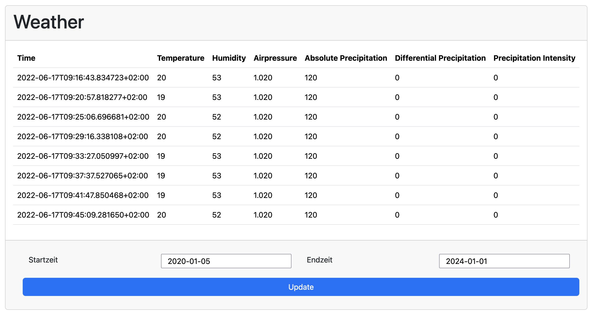

# BeIntelli Platform Java Example

## Description
In this example project, the user can select a time period to retrieve weather data from the BeIntelli platform.

## Getting Started
- Install Maven
- Go to the project folder
- Run the command `mvn spring-boot:run`.
- The application can be accessed in the browser at http://localhost:8080.

## Features
- Authentication
- Selection of a timeframe

## Development
The Backend logic is written in Java and the UI is created with [Spring Boot](https://spring.io/projects/spring-boot).

## Authors

[@eliasinguanta](https://gitlab.com/eliasinguanta)

## License

[MIT](https://opensource.org/license/mit)

## Reference Documentation
For further reference, please consider the following sections:

* [Official Apache Maven documentation](https://maven.apache.org/guides/index.html)
* [Spring Boot Maven Plugin Reference Guide](https://docs.spring.io/spring-boot/docs/3.2.2/maven-plugin/reference/html/)
* [Create an OCI image](https://docs.spring.io/spring-boot/docs/3.2.2/maven-plugin/reference/html/#build-image)
* [Spring Web](https://docs.spring.io/spring-boot/docs/3.2.2/reference/htmlsingle/index.html#web)
* [Thymeleaf](https://docs.spring.io/spring-boot/docs/3.2.2/reference/htmlsingle/index.html#web.servlet.spring-mvc.template-engines)

## Context
This project was created as part of my bachelor's thesis. The work dealt with the conception of an SDK for a data platform. This application is implemented once without and with SDK, is intended to serve as a starting point for the conception of a suitable SDK and to demonstrate simplified development using the SDK.